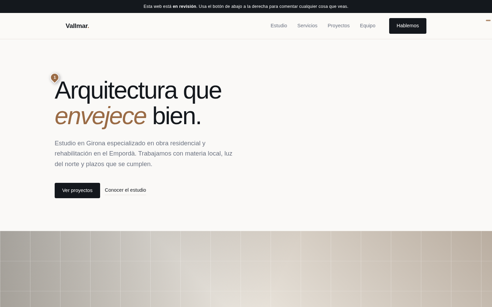
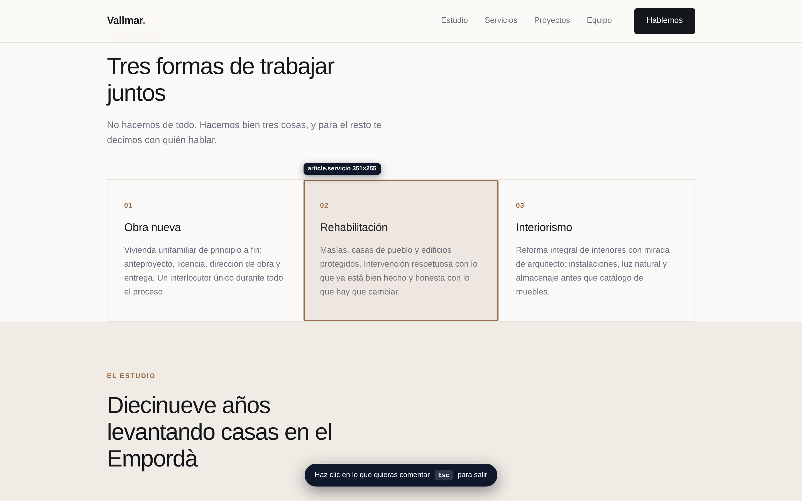
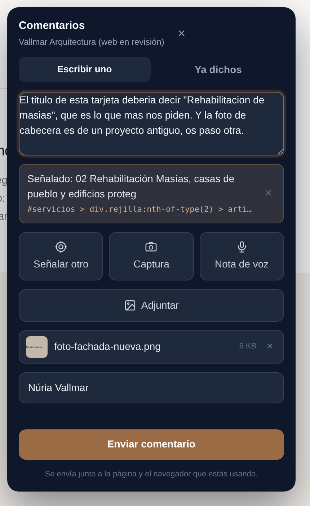
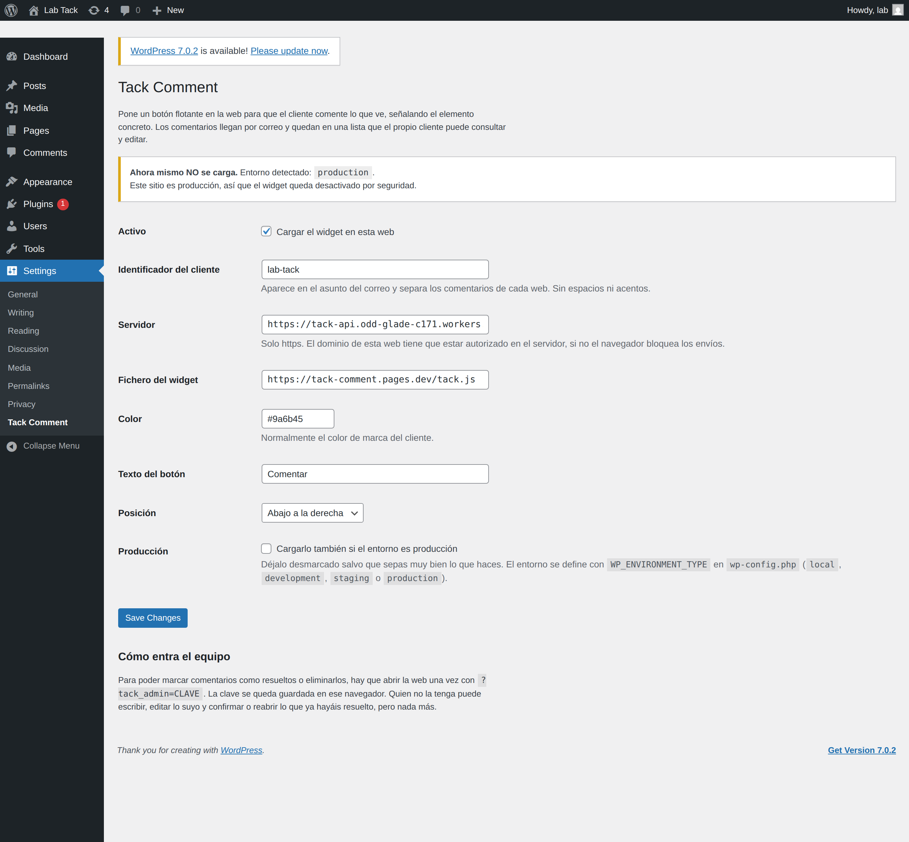
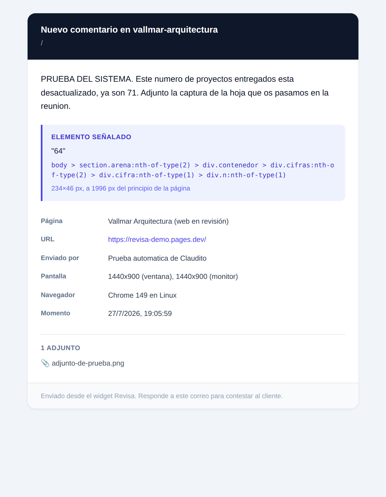

# Tack Comment

**Your client points at the thing they don't like, instead of describing it in an email.**

A floating button you drop into a site you're building, so the client can comment on what
they see. They point at the exact element, attach a screenshot, record a voice note, and
you get it in your inbox with the CSS selector and the browser they were using.

No account, no SaaS, no per-seat pricing. One `<script>` tag and a Cloudflare Worker you own.



---

## Why

Every agency knows this email:

> *"the button at the top doesn't convince me, and the photo in the section about us
> looks weird on my phone"*

Which button. Which page. Which phone. You end up in a five-email thread to find out what
they meant, and then you do it again next week.

Tack Comment turns that into: the client clicks the element, types one line, and you get
`#services > div.grid:nth-of-type(2) > article` with a screenshot attached.

There are good tools that do this (markup.io, BugHerd, Atarim, Pastel). They're all paid,
per seat, and your clients' comments live on someone else's server. This one is free, and
the data sits in your own Cloudflare account.

## What it does

- **Point at one or more elements.** Inspector-style highlight; stores the CSS selector,
  the text and the position of each one.
- **Screenshot, image attachments and voice notes** (up to 2 minutes), all in one comment.
- **The comments come back.** They're stored, so the client sees what they already said,
  grouped by page, and **can edit their own**. Each edit emails you the previous text
  struck through, so you don't work off a stale version.
- **Numbered pins on the page** plus a **scrollbar ruler**: where the open work is, at a glance.
- **A workflow, not an inbox**: `open → resolved → confirmed | reopened`. Your team can also
  close their own notes in one step, for reminders and internal to-dos.
- **Nudges the client to point**, once, if they try to send without pointing at anything.
  What isn't pointed at can't get a pin, so it floats loose on the page.
- Spanish and English, picked up from the page's `lang` attribute.

| Pointing at an element | Writing the comment |
|---|---|
|  |  |

## It doesn't care what your site is built with

Plain JavaScript, zero dependencies, isolated in a Shadow DOM so the host site's CSS can't
break it. Verified working on React. Anywhere you can put a `<script>` tag:

| Stack | Where |
|---|---|
| **WordPress** | The plugin in `wordpress/` (recommended: it has the production lock) |
| **Astro / Eleventy / Hugo** | Your base layout, before `</body>` |
| **React / Next / Vue** | `index.html` or your root layout |
| **Plain HTML** | Before `</body>` |
| **Shopify / Squarespace / Wix** | Their "custom code" section (paid plans only) |

> ⚠️ **Staging only.** This is a review tool. On a live site every visitor would see the
> button, could write comments and could read everyone else's. The WordPress plugin refuses
> to load in production unless you explicitly override it.

## Install

### 1. Deploy your own backend

You need a [Cloudflare](https://cloudflare.com) account (the free tier is plenty) and a
[Resend](https://resend.com) API key for the emails.

```bash
cd worker
npx wrangler d1 create tack                      # copy the database_id it prints
# paste it into wrangler.toml, then set DESTINO / REMITENTE / ORIGENES_PERMITIDOS
npx wrangler d1 execute tack --remote --file=esquema.sql
npx wrangler deploy

npx wrangler secret put RESEND_API_KEY                       # your Resend key
openssl rand -hex 24 | npx wrangler secret put CLAVE_ADMIN   # your team key, save it
```

`ORIGENES_PERMITIDOS` is the allowlist of sites allowed to send comments. If a domain isn't
in it, the browser blocks the request. That's deliberate.

### 2. Add the widget

```html
<script src="https://cdn.jsdelivr.net/gh/alvaromassana/tack-comment@main/widget/tack.js"
        data-site="client-slug"
        data-endpoint="https://your-worker.workers.dev"
        data-color="#4f46e5"
        defer></script>
```

| Attribute | What for | Default |
|---|---|---|
| `data-site` | Identifies the client, shows up in the email subject | `sin-identificar` |
| `data-endpoint` | Your worker's base URL | none (required) |
| `data-color` | Accent colour, usually the client's brand | `#4f46e5` |
| `data-label` | Button text | `Comentar` / `Comment` |
| `data-position` | `bottom-right`, `bottom-left`, `top-right` | `bottom-right` |
| `data-lang` | `es` or `en`, overrides the page's `lang` | auto |

### 3. Let your team in

Open the site once with `?tack_admin=YOUR_KEY`. It's remembered in that browser.

With the key you can **resolve**, **mark your own notes as done**, **reopen** and **delete**.
Without it you can write, edit your own, and confirm or reopen what's been resolved.
Nothing else.

## The WordPress plugin

Install `wordpress/tack-comment.zip` like any other plugin. Settings under
**Settings → Tack Comment**.



The reason it exists isn't compatibility, it's the lock: it will **not** load if
`wp_get_environment_type()` returns `production`, unless you tick a box, which then shows a
permanent red warning. It also stays out of the admin, ajax calls, cron and feeds.

## What lands in your inbox



## How it's built

```
widget/tack.js   the widget. one file, no dependencies, no build step
worker/          Cloudflare Worker + D1 + Resend
wordpress/       WordPress plugin
demo/            a fake client site to try it on
qa/              browser-driven tests (Playwright)
```

If you're changing something:

```bash
node qa/qa-estados.mjs        # visual states
node qa/qa-persistencia.mjs   # don't lose what you typed
node qa/qa-invitacion.mjs     # the nudge to point at things
node qa/qa-ciclo.mjs KEY      # full lifecycle, writes for real
node qa/qa-permisos.mjs KEY   # who can do what
php wordpress/prueba-guardarrail.php   # the production lock, 20 cases, no WordPress needed
```

The code and its comments are in Spanish. That's where it was written and I'm not going to
pretend otherwise. The interface is bilingual.

## Honest limitations

- **Identity is not authentication.** Who wrote what is an anonymous id in `localStorage`.
  Enough for a private staging site, not enough for anything sensitive. Switch browsers and
  you lose the ability to edit what you wrote.
- **Attachments are emailed, not stored.** The panel shows the count, not the files.
  Storing them would mean adding R2.
- **No rate limiting.** An allowed domain can send as much as it likes.
- **Editing changes the text and the pointed elements**, not the attachments.

## Licence

MIT. Built at [Websalia](https://websalia.com) because we got tired of that email.
