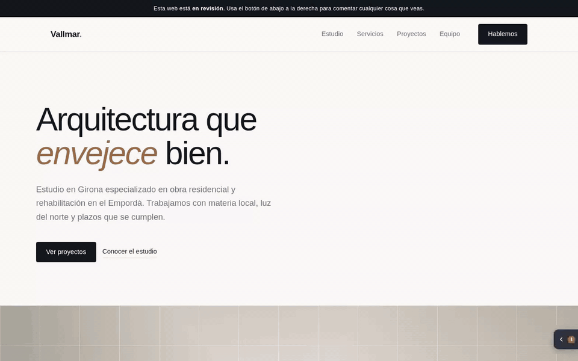

# Feedtack

**Your client points at the thing they don't like, instead of describing it in an email.**

> Feedtack was called **Tack Comment** until September 2026. The old repository URL and the
> old jsDelivr paths still resolve, so existing installs keep working.

**Website and docs: [feedtack.pages.dev](https://feedtack.pages.dev)** · [Docs](https://feedtack.pages.dev/docs/) · [Live demo](https://feedtack.pages.dev/demo/) · [Guide for your client](https://feedtack.pages.dev/guia/)

[](LICENSE)
[](widget/feedtack.js)
[](worker/)
[](https://feedtack.pages.dev)

A floating button you drop into a site you're building, so the client can comment on what
they see. They point at the exact element, attach a screenshot, and you get it in your
inbox with the CSS selector and the browser they were using. The
comments stay on the page as numbered pins, so everyone sees what's open and what's done.

No account, no SaaS, no per-seat pricing. One `<script>` tag and a Cloudflare Worker you own.



**Try it:** [feedtack.pages.dev](https://feedtack.pages.dev) is a fake client site with
the widget installed. Press *Comentar*, point at something, write a line. Comments written
there are real and land in our inbox, so be nice.

---

## Why

Every agency knows this email:

> *"the button at the top doesn't convince me, and the photo in the section about us
> looks weird on my phone"*

Which button. Which page. Which phone. You end up in a five-email thread to find out what
they meant, and then you do it again next week.

Feedtack turns that into: the client clicks the element, types one line, and you get
`#services > div.grid:nth-of-type(2) > article` with a screenshot attached.

There are good tools that do this (markup.io, BugHerd, Atarim, Pastel). They're
subscription services, the free tiers stop at one user or one project, and your clients'
comments live on someone else's server. This one is free, has no tiers, and the data sits
in your own Cloudflare account.

## What it does

- **Point at one or more elements.** Inspector-style highlight; stores the CSS selector, the
  text and the position of each one. While pointing, the **arrow keys walk the hierarchy**
  (up and down for parent and child, left and right for siblings): the mouse only reaches
  the deepest element, and in a hero with a slider you need to choose between the photo,
  the slide and the slider.
- **Screenshot and image attachments**, all in one comment.
- **The comments come back.** They're stored, so the client sees what they already said,
  grouped by page, and **can edit or delete their own**. Each edit emails you the previous
  text struck through, so you don't work off a stale version.
- **Numbered pins on the page** plus a **scrollbar ruler**: where the open work is, at a
  glance. One click hides them when they get in the way.
- **Who asked for what.** Each reviewer gets a personal link (`?feedtack_yo=Name`) and every
  comment from that browser is signed. If nobody used a link, the name is asked once and
  remembered.
- **Every comment is a thread.** Anyone can reply, as many times as needed, and a reply can
  point at an area or attach an image too. The conversation stays next to the thing it's about.
- **A workflow, not an inbox**: `open → resolved → confirmed | reopened`. Whoever wrote a
  comment can close it themselves, and your team can close their own notes in one step, for
  reminders and internal to-dos.
- **Nudges the client to point**, once, if they try to send without pointing at anything.
  What isn't pointed at can't get a pin, so it floats loose on the page.
- **Spanish and English**, picked up from the page's `lang` attribute or forced per site.

| Pointing at an element | Writing the comment | The list, with pins on the page |
|---|---|---|
|  |  |  |

## It doesn't care what your site is built with

Plain JavaScript, zero dependencies, no build step, isolated in a Shadow DOM so the host
site's CSS can't break it. Anywhere you can put a `<script>` tag:

| Stack | Where |
|---|---|
| **WordPress** | The plugin in `wordpress/` (recommended: it has the production lock) |
| **Astro / Eleventy / Hugo** | Your base layout, before `</body>` |
| **React / Next / Vue** | `index.html` or your root layout (verified on React) |
| **Plain HTML** | Before `</body>` |
| **Shopify / Squarespace / Wix** | Their "custom code" section (paid plans only) |

> ⚠️ **Review sites only.** This is a review tool. On a live site every visitor would see the
> button, could write comments and could read everyone else's. The WordPress plugin refuses
> to load in production unless you explicitly override it.

## Quick start

### 1. Deploy your own backend (about ten minutes)

You need a [Cloudflare](https://cloudflare.com) account (the free tier is plenty) and a
[Resend](https://resend.com) API key for the emails.

```bash
cd worker
npx wrangler d1 create feedtack                      # copy the database_id it prints
# paste it into wrangler.toml, then set DESTINO / REMITENTE / ORIGENES_PERMITIDOS
npx wrangler d1 execute feedtack --remote --file=esquema.sql
npx wrangler deploy

npx wrangler secret put RESEND_API_KEY                       # your Resend key
openssl rand -hex 24 | npx wrangler secret put CLAVE_ADMIN   # your team key, save it
```

| Variable | What for |
|---|---|
| `DESTINO` | Where the comments are emailed to |
| `REMITENTE` | The sender address, on a domain verified in Resend |
| `ORIGENES_PERMITIDOS` | Comma-separated allowlist of sites that may send comments. Wildcards like `*.pages.dev` work. Anything else is blocked by CORS, on purpose. |

`GET /salud` on your Worker returns `{"ok":true}` when it's up.

### 2. Add the widget

```html
<script src="https://cdn.jsdelivr.net/gh/alvaromassana/feedtack@main/widget/feedtack.js"
        data-site="client-slug"
        data-endpoint="https://your-worker.workers.dev"
        data-color="#4f46e5"
        defer></script>
```

| Attribute | What for | Default |
|---|---|---|
| `data-site` | Identifies the client, shows up in the email subject | `sin-identificar` |
| `data-endpoint` | Your Worker's base URL | none (required) |
| `data-color` | Accent colour, usually the client's brand | `#4f46e5` |
| `data-label` | Button text | `Comentar` / `Comment` |
| `data-position` | `borde-derecho` (a tab on the right edge), `bottom-right`, `bottom-left`, `top-right` | `borde-derecho` |
| `data-lang` | `es` or `en`, overrides the page's `lang` | auto |

Pin the URL to a release (`@v0.1.0`) instead of `@main` if you don't want to pick up changes
automatically.

### 3. Hand out the links

- **Your team**: open the site once with `?feedtack_admin=YOUR_KEY`. It's remembered in that
  browser. With the key you can resolve, mark your own notes as done, reopen and delete.
- **Each reviewer**: send them `https://staging.example.com/?feedtack_yo=Their%20Name`. From then
  on everything they write is signed, and they can edit or delete their own comments.
  Without a link, the widget asks for a name the first time and remembers it.

Without the key you can write, edit and delete your own, and confirm or reopen what's been
resolved. Nothing else.

- **Give reviewers the guide too**: [feedtack.pages.dev/guia/](https://feedtack.pages.dev/guia/)
  (Spanish) and [/guia/en/](https://feedtack.pages.dev/guia/en/) (English). Every action in
  clips of a few seconds, same page for everyone, no sign-up. Regenerate it with
  `node qa/guia-clips.mjs` when the widget changes.

## The WordPress plugin

Install `wordpress/feedtack.zip` like any other plugin. Settings under
**Settings → Feedtack**: site slug, Worker endpoint, colour, button text, position and
panel language (leave it empty to follow the page's `lang`; set it when the site is written
in one language and reviewed in another).


The reason it exists isn't compatibility, it's the lock: it will **not** load if
`wp_get_environment_type()` returns `production`, unless you tick a box, which then shows a
permanent red warning. It also stays out of the admin, ajax calls, cron and feeds. The
environment comes from `WP_ENVIRONMENT_TYPE` in `wp-config.php`.

## What lands in your inbox

Every new comment, edit, reopening and deletion sends an email with the text (previous
version struck through on edits), the pointed elements with their selectors and sizes, the
attachments, and the context: page, URL, viewport, browser, OS, scroll position, time.


## The review workflow

```
open  ──(your team, with the key)──>  resolved  ──(the client)──>  confirmed
  ^                                       │
  └───────────(the client)──────────  reopened
```

The client writes and can edit their own while it's not closed. Your team resolves. The
client confirms or reopens, and you get an email either way. Deleting (by the team or by the
author) emails a copy, which is the only trace that's kept.

## What is stored, and where

One table in your D1 database, `comentarios`: the text, the pointed elements (selector, text,
position), the page, the anonymous author id and name, the state, a history of state changes
and previous texts, and the browser context. See [`worker/esquema.sql`](worker/esquema.sql).

**Attachments are emailed, not stored.** The panel shows the count, not the files. Storing
them would mean adding R2.

## Honest limitations

- **Identity is not authentication.** Who wrote what is an anonymous id in `localStorage`.
  Enough for a private staging site, not enough for anything sensitive. Switch browsers and
  you lose the ability to edit what you wrote (a personal link restores the name, not the id).
- **No rate limiting.** An allowed domain can send as much as it likes.
- **Editing changes the text and the pointed elements**, not the attachments.
- **Screenshots use `getDisplayMedia`**, so the browser asks the reviewer to share their
  screen. On browsers without it they can attach a screenshot they took themselves.

See [SECURITY.md](SECURITY.md) for the full picture.

## How it's built

```
widget/feedtack.js   the widget. one file, no dependencies, no build step
worker/          Cloudflare Worker + D1 + Resend
wordpress/       WordPress plugin (source and installable zip)
demo/            a fake client site to try it on
qa/              browser-driven tests (Playwright)
```

Running the checks, and what we ask of a pull request, is in [CONTRIBUTING.md](CONTRIBUTING.md).
Changes are listed in [CHANGELOG.md](CHANGELOG.md).

The code and its comments are in Spanish. That's where it was written and I'm not going to
pretend otherwise. The interface is bilingual.

## Licence

MIT. Built at [Websalia](https://websalia.com), a web agency in Barcelona, because we got
tired of that email. The first day it went in front of a real client it grew per-person
links, a name that's asked once, and the arrow keys.
